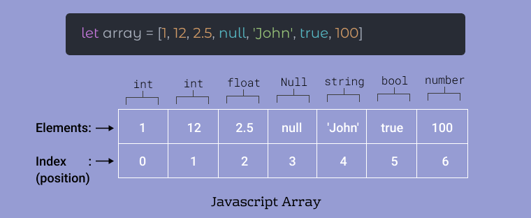
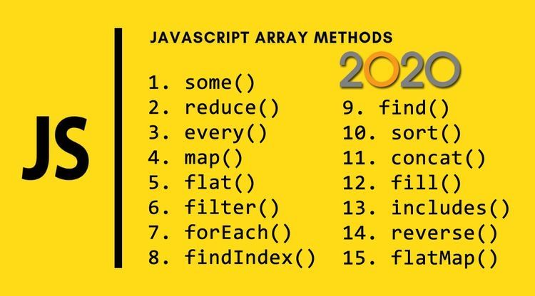
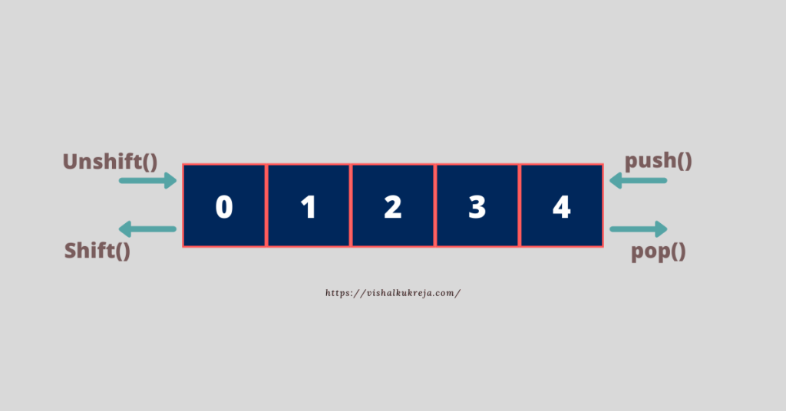
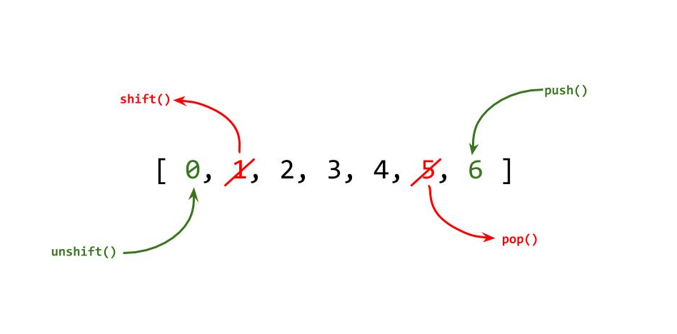
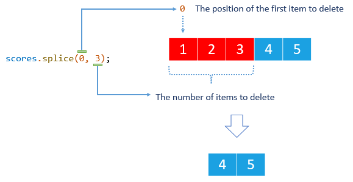
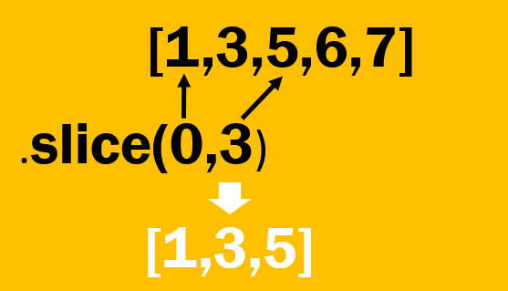
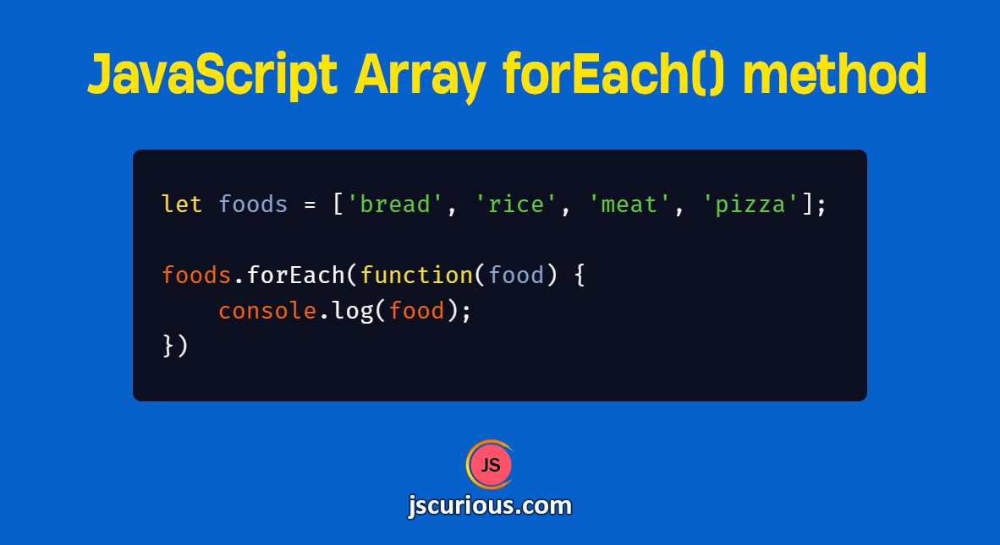
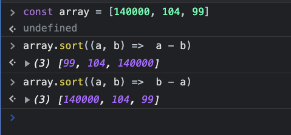
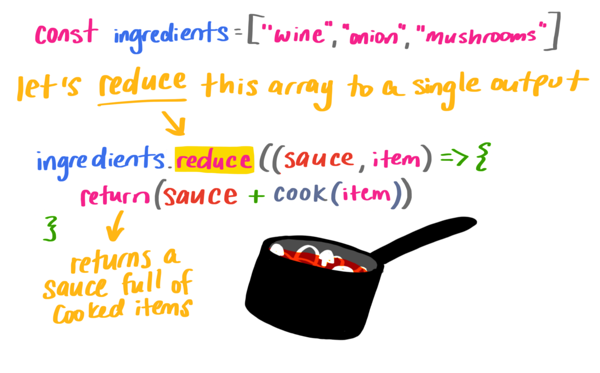

# Table of Contents
1. #### Array
2. #### Array methods
3. #### Destructuring, spread, rest
# Array
##### An array is an object that holds values (of any type) not particurly in name properties/keys, but rather in numerically indexed position.
##### In JavaScript, an array is an ordered list of values.Each value is called an element specified by an index. ... First, an array can hold values of mixed types. 

# Change elements in Array 
- ##### You can also add elements or change the elements by accessing the index value. 
- ##### Suppose, an array has two elements.Of you try to add an element at index 3(fourth element), the third element will be undefined.

# ARRAY METHODS :
##### pop() , push() , shift() , unshift() , toString() , splice() , slice() , reverse() , concat() , join() , map() , filter() , find() , reduce() , forEach() , sort(), indexOf() , includes(). 

# Add elements to an Array
#### Push () && Unshift ():
#### You can use the built-in method push() and unshift() to add elements to an array.

# Delete and Element in Array 
#### Pop() && shift()

# JAVA SCRIPT ARRAY METHODS
#### reverse() , concat()

# JAVA SCRIPT ARRAY METHODS
#### indexOf() && includes()

# JAVA SCRIPT ARRAY METHODS
#### splice()

# JAVA SCRIPT ARRAY METHODS
#### slice()

# JAVA SCRIPT ARRAY METHODS CALLBACKS
#### map()
#### filter()

#### forEach()
#### find()

#### sort()

#### reduce()

